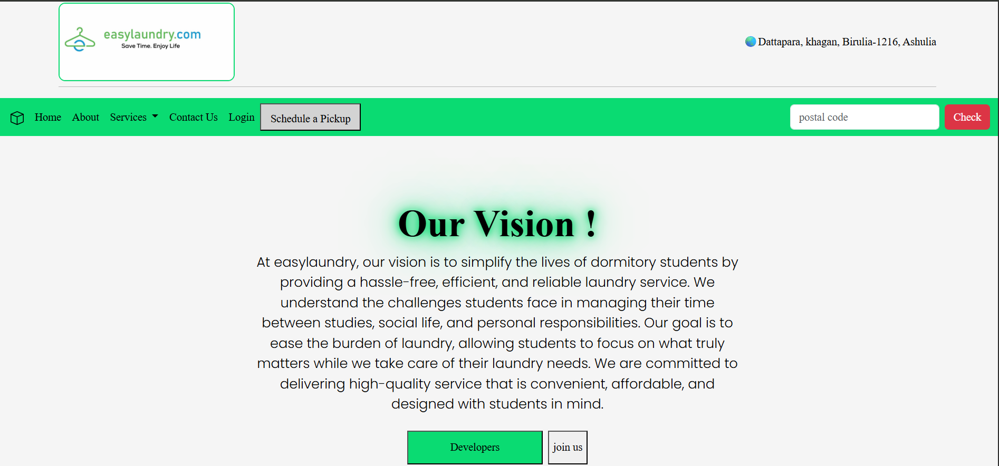
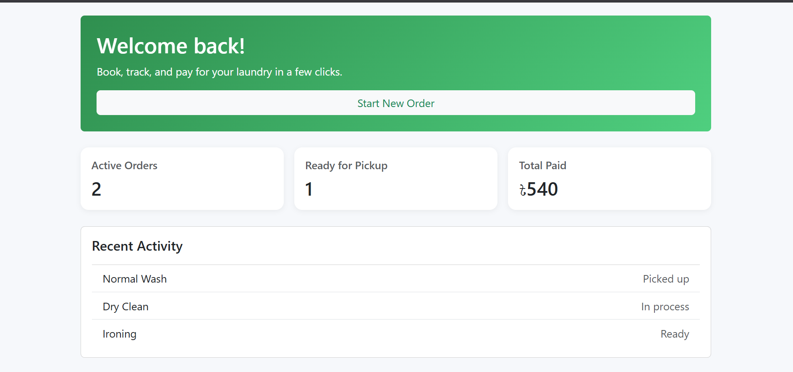

# Easy Laundry

A minimal Django laundry service app with server-rendered pages, simplified pricing, and clean team and dashboard templates.

##

##

## Project overview

This project is a Django-based laundry service platform built for a campus-style workflow. It uses Bootstrap for layout and styling, with simple HTML pages for:

- Homepage and service navigation
- Dashboard and order flow
- Pricing and payment preview pages
- Developer team page

The project is structured as a small Django app inside `easy_laundry/vp` and includes static assets, templates, and route-backed views.

## Key pages

- `landing/home.html` — homepage with a pricing section and service links
- `landing/dev.html` — simplified developer/team page
- `dash/dash.html` — minimal dashboard landing page
- `dash/order.html` — order selection page
- `dash/quantity.html` — item quantity and pricing form page
- `dash/payment.html` — payment method page
- `dash/pricing.html` — compact pricing cards page

## Tech stack

- Python 3 / Django
- Bootstrap 5 for responsive UI
- Django templates for server-rendered pages
- MySQl

## Local setup

1. Open a terminal in `easy_laundry/vp`
2. Activate your Python environment (if available):
   - Windows: `venv\Scripts\activate`
3. Install dependencies:
   - `pip install -r requirements.txt`
4. Run migrations:
   - `python manage.py migrate`
5. Start the development server:
   - `python manage.py runserver`
6. Open `http://127.0.0.1:8000` in your browser

## Customization

- Add or update templates in `vp/templates/landing` and `vp/templates/dash`
- Add new routes inside your Django app `urls.py`
- Place static assets in `vp/static`

## Notes

- The current UI is designed to be minimal and easy to extend.
- Pricing values are hardcoded in the homepage and pricing templates.
- The developer page is a simple team showcase layout.

## Next steps

- Connect the page templates to Django views and actual URL routes
- Replace placeholder links with real app routes
- Add form handling for order and payment actions
- Implement user authentication and booking logic
